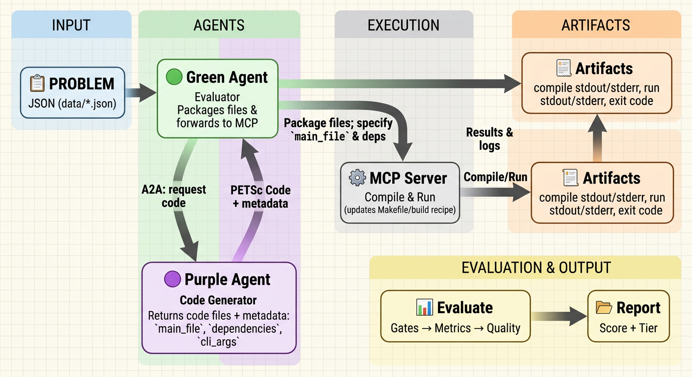

# PETSc Agent Benchmark

An agentified evaluation framework for testing PETSc code generation agents using A2A (Agent-to-Agent) and MCP (Model Context Protocol) standards.

## Overview

This repository implements a multi-agent benchmark for evaluating code generation agents that produce PETSc (Portable, Extensible Toolkit for Scientific Computation) programs.
> [!IMPORTANT]
> 📖 See [MOTIVATION.md](MOTIVATION.md) for the motivation and design rationale behind this project.

Core building blocks:

- **A2A Protocol**: standardized agent-to-agent communication over HTTP.
- **MCP Protocol**: tool access for compilation and execution.
- **Evaluation pipeline**: gates + metrics + LLM-based quality evaluators, aggregated into a composite score and tier.

High-level flow:

1. The **Green Agent** loads benchmark problems from `data/*.json`.
2. For each problem, it asks the **Purple Agent** to generate PETSc code.
3. It compiles and runs the returned code via MCP tools.
4. It evaluates results and writes reports to `output/`.

> Note: Running the benchmark can consume significant LLM tokens depending on the model and number of problems.

## Architecture



The system consists of three components:

1. **Green Agent** (assessment manager)
   - Loads benchmark problems from `data/*.json`
   - Sends each problem description to the Purple Agent via A2A
   - Compiles and runs returned code via MCP tools
   - Scores results (gates + metrics + quality) and aggregates into a composite score + tier
   - Writes reports to `output/`

2. **Purple Agent** (target under test)
   - Receives a problem description via A2A
   - Uses an LLM to generate PETSc code
   - Returns:
     - a status text that includes `cli_args`
     - one or more code files

3. **MCP Server** (tool provider)
   - Provides compilation and execution tools for PETSc code (used by the Green Agent)

### Why PETSc?

PETSc is an ideal benchmark for evaluating LLM capabilities in scientific computing because it demands:

- **Domain expertise**: Numerical methods, PDEs, linear algebra, and parallel computing
- **Large API surface**: 1000+ functions across solvers (TS, SNES, KSP), data structures (Vec, Mat, DM), and optimizers (TAO)
- **Correctness and performance**: Solutions must be mathematically accurate *and* computationally efficient
- **Parallel programming**: MPI, domain decomposition, GPU acceleration (CUDA/HIP)

Unlike toy benchmarks, PETSc code generation tests whether LLMs can produce **scientifically valid, performant, and maintainable** solutions for real-world HPC applications. See [PETSc applications](https://petsc.org/main/miscellaneous/applications_publications/) for examples spanning climate modeling, CFD, astrophysics, and more.


## Evaluation System

At a high level, evaluation is organized into:

- **Gates**: binary pass/fail checks (e.g., compilation/execution/API usage)
- **Metrics**: quantitative measurements (e.g., numerical accuracy, execution time)
- **Quality**: LLM-based qualitative assessment (e.g., code style, algorithm choice, PETSc best practices)

> [!IMPORTANT]
> For full details on the evaluation design, scoring, and components, see [EVALUATION_SYSTEM_SUMMARY.md](EVALUATION_SYSTEM_SUMMARY.md).

## Benchmark Problems

Benchmark problems are defined as JSON files under `data/`. The Green Agent loads **all** JSON files in that directory. 

Each problem file is expected to contain (at minimum):

- `problem_name`
- `problem_id`
- `problem_description`

Current suite (see `data/` for full definitions):

- Robertson ODE
- 1D Advection
- Rosenbrock optimization
- Darcy flow
- 2D Navier–Stokes
- Vec/MPI tests

`gpu_data` contains problems that run on GPUs. Since our Github runners do not support GPU at the moment, they are not included in the default setting, but can be activated manually. 

### Evaluation Criteria

Each problem is evaluated across multiple dimensions (see `config/green_agent_config.yaml` for weights):

- Correctness
- Performance
- Code quality
- Algorithm choice
- PETSc best practices
- Semantic correctness

#### Numerical accuracy

Each test case in `data/*.json` declares what its reference number means and
how close is close enough:

```json
{
  "args": "-ts_type beuler",
  "expected_output": [1.0e-9],
  "comparison": "upper_bound",
  "tolerance": 0.0
}
```

`comparison` is `match` (the default), where the reference is a target scored
on relative L2 distance, or `upper_bound`, where it is a ceiling scored on
relative overshoot alone so a result below the ceiling is free. Use
`upper_bound` for quantities that are bounds rather than values, such as the
maximum discrete divergence in NS2D. `tolerance` falls back to
`numerical_accuracy.tolerance` in `config/green_agent_config.yaml`. A result
inside the tolerance scores 1.0 and one outside decays exponentially.

Convergence studies use ordinary `match` cases at coarse and fine resolutions.
Their reference errors encode the expected order, so standard per-case scoring
handles them without a separate convergence path. Problems with several test
cases are run once per case, on the agent's requested `cli_args` with the
arguments that case declares appended last, so PETSc's last-wins lets a case
override the agent only on the keys it names.

Known limitation: an agent that prints `0.0` without solving anything
satisfies an `upper_bound`. Use `match` when an implausibly small value should
not receive credit, as in convergence-study cases.

## Output

### Files written to disk

The Green Agent writes the scores of a pass to one aggregate JSON in
`output/`, named after the model under test and the judge used to score it:

- `output/<purple_model>-judged-by-<green_model>.json`, for example
  `output/gpt52-judged-by-claudeopus46.json`

A live run writes that file and overwrites whatever it finds there. A rescore
writes a numbered copy instead, `-s<N>.json`, where *N* comes from `--pass`, so
replaying never destroys the run being replayed. The number is given rather
than derived, so `--replay` without `--pass` is an error. Each file contains
the overall summary, per-problem results, and the provenance of the pass
(`purple_model`, `judge_model`, `pass_index`, `submissions`) along with
per-problem token counts.

The code goes to `output/code/<purple_model>/` and the scores to
`output/scores/<purple_model>/`. The code belongs to the Purple Agent rather
than to any judge, so one code tree serves every judge that scores it, and
every judge writes into the matching score tree:

```
output/
├── gpt52-judged-by-claudeopus46.json             # the live run
├── gpt52-judged-by-claudeopus46-s1.json          # --replay --pass 1
├── gpt52-judged-by-gemini25pro.json              # a second judge
├── code/
│   └── gpt52/
│       ├── manifest.json
│       └── advectionpde/
│           └── Advection_PDE.c
└── scores/
    └── gpt52/
        └── advectionpde/
            ├── judged-by-claudeopus46.json    # the latest pass by this judge
            └── judged-by-gemini25pro.json
```

The two are separate because a score record carries the full source it graded
along with its `sha256`, so it never has to point at a file. The code tree
holds the latest generation of each problem and a run that regenerates one
overwrites it, which strands nothing. `manifest.json` records the `sha256` of
what is on disk now, so a score can be told apart from the current code without
reading either.

Both trees hold the current state rather than a history, as does the
unnumbered aggregate. A later pass overwrites a score file, and the pass it
came from is inside it as `pass_index`, null for a live run. History is what
the numbered aggregates are for, so a pass worth keeping asks for a number and
the trees never have to carry one.

Keeping the code of two generations side by side as files still needs two
directories. Pass `--output <dir>`, or set `output_dir` in
`config/green_agent_config.yaml` for a default. The flag wins over both the
config and the rule that sends a rescore beside the run it replays, since it
is the only one of the three the caller stated for this run.
`run_argo_grid.py` passes the flag for you, leaving repetition 1 in `output`
and sending each later repetition *N* to `output-rep<N>`.

Solving the suite a few problems at a time works, because a run adds the
problems it generated to the manifest rather than rebuilding it, so the ones an
earlier run solved keep their entries.

Each per-problem result also includes Purple Agent efficiency measured at the
A2A boundary: request/response bytes, response-event count, time to first
response, total wall-clock latency, and whether the response came from the
cache. An A2A client interceptor observes each request and response event.
Request and response bytes are both
measured from the canonical A2A 1.x protobuf payload, so the two are directly
comparable. Purple Agents may additionally return a structured A2A data `Part`
using the optional
`petscagent.telemetry.v1` schema:

```json
{
  "schema_version": "petscagent.telemetry.v1",
  "model": "pdesim-gpt-5.2-c3",
  "model_calls": 5,
  "tool_calls": 8,
  "input_tokens": 24000,
  "output_tokens": 6000,
  "total_tokens": 30000,
  "cached_tokens": 12000,
  "peak_context_tokens": 18000,
  "cost_usd": 0.51
}
```

All fields except `schema_version` are optional. These internal values are
agent-declared because the Green Agent cannot independently observe an agent's
framework, model calls, context, tools, or provider billing. Missing values are
reported as unavailable rather than zero and do not affect the quality score.

`model` is an identity string rather than a metric. It is the name the agent
wants recorded for this run, and the Green Agent uses it to name the output
file, so a composite agent can encode its own configuration. When it is absent
Green falls back to the `purple_model` tag the run was launched with. The
launched tag is recorded as `purple_model` in the result file either way, and
the self-reported name appears alongside it as `reported_model`. A value that
is not a non-empty string is dropped. A self-reported name from a cached
response is ignored, because a cached response replays the telemetry of the
run that filled the cache.

Every other field except `cost_usd` counts discrete events and must
be a whole number; fractional, negative, or non-numeric values are dropped.
`model_calls` counts logical model invocation attempts initiated by the Purple
Agent; retries hidden inside a provider or SDK are excluded unless the agent
can observe them. `tool_calls` counts tool invocation attempts initiated by the
Purple Agent, including failed attempts. Agents that cannot measure a field
omit it.

The included reference Purple Agent asks LiteLLM to calculate `cost_usd` from
provider pricing metadata and reports its single call's total tokens as
`peak_context_tokens`. If pricing is unavailable for a model or custom gateway,
the cost field is omitted rather than estimated.

The run summary reports these under `purple_efficiency`, split into
`benchmark_measured` and `agent_declared`. Both halves cover only the cases
actually sent to the agent during the run. A replayed response carries an
earlier run's telemetry, so replayed cases are counted in `replayed_cases` and
excluded from every other figure, while the per-problem record keeps its
telemetry.

Each live problem also receives a separate `efficiency_score`; it does not
change `composite_score` or the GOLD/SILVER/BRONZE tier. The budgets are fixed
in `config/green_agent_config.yaml`, and the score is:

```text
time_score = min(1, time_budget_sec / purple_wall_time_sec)
byte_score = min(1, response_bytes_budget / purple_response_bytes)
efficiency_score = 100 * sqrt(time_score * byte_score)
```

A solution is successful for this score when it runs and all evaluation gates
pass; an unsuccessful solution scores zero. Cached responses have no efficiency
score because no Purple Agent work occurred during that benchmark run.

### Task artifacts

The Green Agent also emits A2A task artifacts (via `TaskUpdater.add_artifact`). Depending on your runner/integration, these may be downloadable from logs/UI but are not written to `output/` by default:

### Tier System

Codes are assigned to tiers based on composite scores:

- 🥇 **GOLD** (≥85): Excellent code quality and correctness
- 🥈 **SILVER** (≥70): Good code with minor issues
- 🥉 **BRONZE** (≥50): Functional but needs improvement
- ❌ **FAIL** (<50 or gate failure): Significant issues

## Project Structure

```
├── data/                           # Benchmark problems (JSON files)
├── config/                         # Configuration files
│   ├── green_agent_config.yaml     # Green agent evaluation + scoring + LLM settings
│   └── purple_agent_config.yaml    # Purple agent LLM settings
├── src/
│   ├── client_cli.py               # Sends “start benchmark” task to the Green Agent
│   ├── launcher.py                 # Spawns Green/Purple/MCP locally (end-to-end)
│   ├── green_agent/                # Assessment manager agent
│   ├── purple_agent/               # Target agent under test
│   ├── evaluators/                 # Gates / metrics / quality evaluators
│   ├── metrics/                    # Score aggregation + tiering
│   └── util/                       # A2A helpers + LLM client
├── main.py                         # CLI entry point (green/purple/launch)
├── pyproject.toml                  # Python project configuration
└── output/                         # Generated reports and results
```

## Installation

### Prerequisites

1. **PETSc Installation**: Install PETSc from [https://petsc.org/](https://petsc.org/) for local compilation/execution.
2. **Python 3.12+**: Required (see `pyproject.toml`).
3. **uv**: Python package manager used by this repo: https://github.com/astral-sh/uv

### Setup

1. Install dependencies using `uv`:

```bash
uv sync
```

2. Create a `.env` file in the root directory with the following variables:

```bash
# LLM API Keys
GEMINI_API_KEY="<your_gemini_key>"
OPENAI_API_KEY="<your_openai_key>"

# Argo (ANL) authenticates with your ANL domain username
ARGO_API_KEY="<your_anl_username>"

# PETSc Configuration (required for compilation/execution)
PETSC_DIR="<path_to_petsc_installation>"
PETSC_ARCH="<petsc_architecture>"  # e.g., arch-darwin-c-debug
```

## Usage

### Quick Start

For local testing, launch the complete evaluation workflow:

```bash
uv run main.py launch
```

This command will:
1. Start the Green Agent (assessment manager)
2. Start the Purple Agent (code generator)
3. Start the MCP server (compilation/execution tools)
4. Run all benchmark problems
5. Generate evaluation reports in `output/`

### Deploying Individual Components

You can run the components separately (useful when deploying services on different machines or restarting a single component during development).

```bash
# Start only the Green Agent
uv run src/green_agent/server.py

# Start only the Purple Agent
uv run src/purple_agent/petsc_agent.py
```

For MCP server deployment, refer to https://gitlab.com/petsc/petsc_mcp_servers

Once the Green Agent, Purple Agent, and MCP server are running, trigger a benchmark run by sending the task message to the Green Agent:

```bash
uv run src/client_cli.py --green-url <GREEN_URL> --purple-url <PURPLE_URL> --mcp-server-url <MCP_URL>
```

### Benchmarking an external agent

To evaluate an agent you start yourself, point `launch` at it. The Green Agent and MCP server are started and stopped as usual; your agent is left running.

```bash
uv run main.py launch --purple-url http://localhost:9002
```

Your agent names its own output file by self-reporting a `model` in its telemetry.
Without one the run is filed as `unknown-...`.

The Green Agent streams progress, emitting one event per problem, so the 3000s client read timeout applies to the gap between events rather than to the whole suite.

### Configuration

The system uses separate configuration files for each agent:

- `config/green_agent_config.yaml` - Green agent LLM model and evaluation settings
- `config/purple_agent_config.yaml` - Purple agent LLM model settings

Example `config/green_agent_config.yaml`:

```yaml
evaluation:
  enable_gates: true          # Enable binary pass/fail checks
  enable_metrics: true        # Enable quantitative measurements
  enable_quality: true        # Enable quality assessments
  parallel_evaluation: true   # Run evaluators in parallel
  
  llm:
    model: "openai/gpt52"            # LLM for quality evaluation
    api_base_url: "https://apps-dev.inside.anl.gov/argoapi/v1"  # Optional API base URL (e.g., Argo/AskSage)
    temperature: 0                    # Set to 0 only for reproducibility
    max_tokens: 32000                 # Pin the completion limit (see note below)
    max_concurrent_calls: 3           # Rate limiting for LLM calls

scoring:
  weights:
    correctness: 0.35     # Weight for correctness score
    performance: 0.15     # Weight for performance metrics
    code_quality: 0.15    # Weight for code quality
    algorithm: 0.15       # Weight for algorithm choice
    petsc: 0.10          # Weight for PETSc best practices
    semantic: 0.10       # Weight for semantic correctness
  
  tiers:
    gold: 85      # Minimum score for GOLD tier
    silver: 70    # Minimum score for SILVER tier
    bronze: 50    # Minimum score for BRONZE tier
```

Example `config/purple_agent_config.yaml`:

```yaml
llm:
  model: "openai/claudeopus45"     # LLM for code generation
  api_base_url: "https://apps-dev.inside.anl.gov/argoapi/v1"  # Optional API base URL (e.g., Argo/AskSage)
  temperature: 0                    # Set to 0 only for reproducibility
  max_tokens: 32000                 # Pin the completion limit (see note below)
```

**Note**:
- Use a LiteLLM-style name, e.g. `<provider_name>/<model_name>`. For models provided with an OpenAI-compatible endpoint, use `openai` as the provider name.
- Leave `api_base_url` `null` to use each provider’s default (e.g. `https://api.openai.com/v1`). Set this to use a custom or proxy endpoint (e.g. `https://apps-dev.inside.anl.gov/argoapi/v1` for Argo). For OpenAI-compatible APIs the URL should end with `/v1`; the client will use the appropriate LiteLLM provider prefix.
- The system auto-detects AskSage endpoints when `api_base_url` starts with `https://api.asksage.anl.gov` and configures SSL and API keys accordingly.
- Argo endpoints (`*.inside.anl.gov/argoapi`) authenticate with your ANL domain username, read from `ARGO_API_KEY`.
- **Pin `max_tokens`.** Serving endpoints may default to a low completion limit (4096 has been observed), which silently truncates long solutions. A truncated reply fails to parse and scores zero, and the failure looks like a generation error rather than a configuration problem. The hardest benchmark problems need 5k--18k completion tokens, so 32000 leaves adequate headroom. When a generation does fail, the purple agent writes the raw reply to `failed_responses/` for inspection.
- Some endpoints reject large `max_tokens` on their non-streaming path. On Argo, Claude models accept 32000 only on the Anthropic-native base URL (`.../argoapi`, no `/v1` suffix); the OpenAI-compatible path caps near 20000.


## Development

### Adding custom evaluators

Evaluators live under `src/evaluators/` and are wired into the pipeline in `src/evaluators/pipeline.py`.

To add a new evaluator:

1. Create a class inheriting from `src.evaluators.base.Evaluator`
2. Implement `name`, `evaluator_type`, and `evaluate(...)`
3. Add the evaluator to the pipeline

Example:

```python
from src.evaluators.base import Evaluator, EvaluatorType, EvaluationResult

class MyCustomEvaluator(Evaluator):
    @property
    def name(self) -> str:
        return "my_custom_check"
    
    @property
    def evaluator_type(self) -> EvaluatorType:
        return EvaluatorType.QUALITY

    async def evaluate(self, code: str, problem: dict, execution_result: dict | None = None) -> EvaluationResult:
        return EvaluationResult(
            evaluator_name=self.name,
            evaluator_type=self.evaluator_type,
            quality_score=0.8,
            feedback="Custom evaluation passed",
            evaluation_method="deterministic",
            confidence=1.0,
        )
```

### Replaying a recorded run

`uv run main.py launch --replay output/<run>.json --pass 1` rescores the
submissions a previous run recorded instead of generating new ones. The Purple
Agent is not started and is never contacted. Each problem's
`generated_sources` are rebuilt under their original filenames, so the same
compile and run path applies as on the run that produced them.

This is what makes a judge comparison valid. Two judges scoring the same
replayed submissions differ only by the judge. `run_judge_swap.py` uses it that
way, generating once with the baseline judge and replaying that output file for
every other judge, then asserting the gates came out identical.

A rescore always sweeps the whole recorded run, so `--problems` is refused
alongside `--replay`, and a replay file disagreeing with `data/` in either
direction aborts before scoring. Writing back fewer problems than were read
would leave the ones left out with no copy of their code anywhere, since
replay reads submissions from the file rather than from the tree.

A rescore writes into the directory holding the file it replays, unless
`--output` names another one, under the number `--pass` gives it. The number
is required, because without one the rescore would land on the live aggregate
and overwrite the run it is replaying. Two rescores of one run therefore need
two numbers, and reusing a number is how you redo a pass. The rescore leaves
the replayed file and the code tree as they are, since replaying an earlier
generation would otherwise put old code back over whatever the tree holds now.
Replaying a run recorded before the tree existed builds one from the sources
the file already carries.

Replayed problems are marked `purple_response_replayed` in the results, and
they are excluded from efficiency aggregates and from the self-reported model
detection, because their telemetry describes the earlier run.

## Troubleshooting

### Common Issues

1. **Wrong Python version**: This repo requires Python **3.12+** (see `pyproject.toml`).
2. **PETSc not found**: Ensure `PETSC_DIR` and `PETSC_ARCH` are set correctly in `.env`.
3. **LLM API/proxy errors**:
   - Verify API keys are valid and have sufficient quota.
   - If using an OpenAI-compatible proxy (Argo/AskSage), ensure `api_base_url` is set correctly in the relevant config.
   - For AskSage endpoints, ensure `ASKSAGE_API_KEY` and `ASKSAGE_SSL_CERT_FILE` are set.
4. **Agent connectivity / timeouts**:
   - Confirm the Green and Purple URLs/ports match your deployment.
   - If agents are slow to start, you may need to increase timeouts in `src/util/a2a_comm.py`.
5. **Port conflicts**: Modify ports in `src/launcher.py` if defaults are in use (Green `9001`, Purple `9002`, MCP `8080`).

## Release history

See [CHANGELOG.md](CHANGELOG.md) for release notes.
6. **Missing output files**: Only the aggregate `output/<purple_model>-judged-by-<green_model>.json` file, the `output/code/<purple_model>/` tree and the `output/scores/<purple_model>/` tree are written to disk by default; other reports are emitted as task artifacts.
